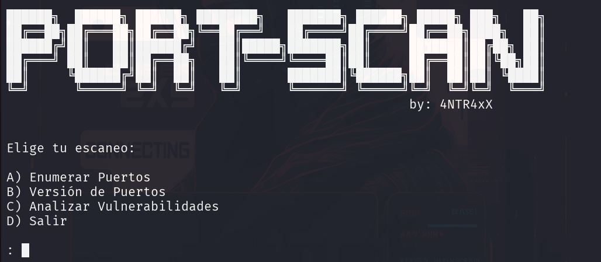

🚀 Port-Scan - Script de Automatización




Este script en Bash automatiza distintos tipos de escaneo con Nmap, permitiéndote obtener información clave sobre puertos abiertos, versiones de servicios y vulnerabilidades.

🔹 Características

✅ Enumeración de puertos abiertos

✅ Detección de versiones de servicios

✅ Análisis de vulnerabilidades con scripts de Nmap

✅ Copia automática de puertos abiertos al portapapeles (si xclip está instalado)

📌 Requisitos

Nmap instalado (sudo apt install nmap)

xclip para copiar puertos al portapapeles (sudo apt install xclip)

📥 Instalación
```bash
git clone https://github.com/4NTR4xX01/Port-Scan.git
cd Port-Scan
chmod +x Port-Scan.sh
```
🚀 Uso

Ejecuta el script con permisos de root:

```bash
sudo ./Port-Scan.sh
```
